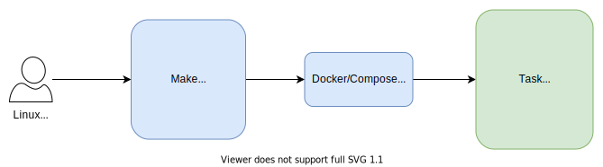

# dbt demo using 3 Musketeers

Demo of using 3 Musketeers to setup and configure a dbt project.

---

## Contents

1. High-level summary
2. Getting started
    * Prerequisites
    * How-to run

---

## 1. High-level summary

* 3 Musketeers is a pattern for developing software in a repeatable and consistent manner
* It leverages `Make` as an orchestration tool to test, build, run, and deploy applications using `Docker` and `Docker Compose`
* The `Make` and `Docker/Compose` commands for each application are maintained as part of the application’s source code and are invoked in the same way whether run locally or on a CI/CD server.

    

The benefits of using 3 Musketeers are:

#### Consistency
Run the same commands no matter what environment you're using:
* OS: Linux, MacOS, Windows
* CI/CD tools that supports Docker like GitHub Actions, Travis CI, CircleCI, and GitLab CI
#### Confidence
* Test your code and pipelines locally before your CI/CD tool runs it
* Feel confident that if it works locally, it will work in your CI/CD server
#### Control
* Take control of languages, versions, and tools you need, and version source control your pipelines with your preferred VCS like GitHub and GitLab.

### Technologies used

- dbt
- 3 Musketeers (Make, Docker, and Docker-Compose)

---

## 2. Getting started

### Prerequisites

Before you begin, ensure you have the following installed

* Make
* Docker
* gettext (this is used for the dbt project setup automation, so not necessarily mandatory)
* gnu-sed (this is used for the dbt project setup automation, so not necessarily mandatory)

### How-to run

1. Install the prerequisite libs by running: `make deps`
2. Configure your input dbt models within the folders that sit underneath the dbt build automation script, `/bin/dbt_setup_automation/models/`. I.e.:
    * `models`
    * `profiles`
    * `tests`
3. Run `make install` to build your dbt project and validate the connectivity
